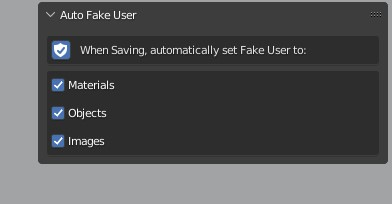

# Auto-Fake-User

Blender Add-on that will automatically enable Fake User for user selected data blocks when saving the file, such as materials, objects and more.

# How to install

Simply install the add-on .zip file

# Where it will be

View3D > Sidebar > Tool Tab > Auto Fake User

# How to use

- Enable Auto Fake User
- Select all data blocks you want to be Fake User
- Done, every time you save this file, these data blocks will be set to Fake User

